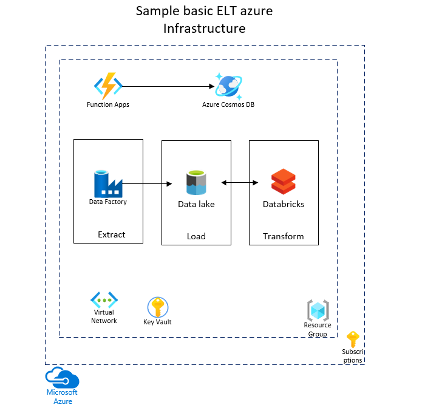

# Cloud Engineering
Infrastructure as a Code automation repo

## Infrastructure

Azure infrastructure services are created using the ARM templates.
1_infrastructure folder contains the arm templates for the azure services. The templates can be updated as per the service configurations. 




## Automation

Infrastructure deployment is automated using the ADO build and release pipelines using YAML templates. 
The 2_automation folder in this repo contains 2 main sub folders

* Release 
* templates

1. Release: This folder contains build and release YAML pipelines
    
    * infra-deployment.yml : All azure services deployment pipeline.
    * func-app-build.yml  : This pipeline deploys the function app.

2. templates: This folder again contains following sub folders:
    
    * jobs-templates
    * steps-templates

    The idea of having the seperate steps and jobs templates is for ease of maintainance and good practice for reusability. Each azure service will have a steps templates defined. Wherever required the parameters can be specified for the arm templates. 
    
    The Jobs templates contains all the jobs definitions. This way of defining jobs templates helps to perform group of services deployment by referencing the steps templates.  


## API 

The sample API is an azure function app. This service is hosted on consumtion plan. 
This function app is a HTTP based api which fetches record from an azure cosmos database.#

This HTTP based api accepts the source as query string parameter and return the comment/review received from the source. 

sample cosmos records/items

```json
{
    "id": "1",
    "source": "earth",
    "comment": "This is best place to live",
    "_rid": "Kb06ALjSKf8BAAAAAAAAAA==",
    "_self": "dbs/Kb06AA==/colls/Kb06ALjSKf8=/docs/Kb06ALjSKf8BAAAAAAAAAA==/",
    "_etag": "\"0100c528-0000-0c00-0000-61c9bb3d0000\"",
    "_attachments": "attachments/",
    "_ts": 1640610621
}

{
    "id": "2",
    "source": "mars",
    "comment": "This is not a best place to live yet",
    "_rid": "Kb06ALjSKf8CAAAAAAAAAA==",
    "_self": "dbs/Kb06AA==/colls/Kb06ALjSKf8=/docs/Kb06ALjSKf8CAAAAAAAAAA==/",
    "_etag": "\"0100d728-0000-0c00-0000-61c9bb6b0000\"",
    "_attachments": "attachments/",
    "_ts": 1640610667
}
```


